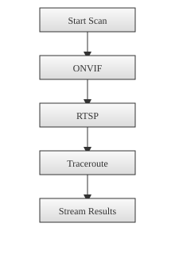

# Camera Discovery

Glimpser includes a simple discovery feature to help find network cameras on your local LAN. The **Discover** tab on the **Settings** page now loads immediately and only scans when you click the **Discover** button. Starting a scan automatically enables hourly background discovery if it isn't already running. Use the **Stop Discovery** button to halt it. A progress bar displays the number of completed stages so you know the scan is making progress. The page also shows which discovery stage is currently executing. The logic in `app/utils/camera_discovery.py` runs in parallel threads so results return faster. To keep the scan quick, each interface is limited to a `/24` subnet even if the reported mask is larger. Interfaces that are down or using loopback or link-local addresses are ignored so the default scan only targets routable LAN networks.

The flow below illustrates the major discovery stages:


The subnet list is now deduplicated so machines with multiple addresses per interface are scanned only once. Unreachable ports fail fast so discovery always completes even when some networks are inaccessible.
The page layout now uses card sections and wider progress indicators for a more professional feel while keeping controls grouped logically.
Background discovery can run automatically every hour when the `DISCOVERY_AUTOSTART` setting is enabled. When disabled (the default), the search icon appears white until you start the scan from the Discover tab. The icon turns green when a scan completed recently, yellow while scanning, and red if the last run failed. Hovering over the icon now shows when the last scan finished and when the next one will run. The Discover tab also displays a colored status dot beside the background discovery text so you can quickly see if scanning is active or disabled.
The scheduling call now triggers discovery in a background thread so the UI never hangs when you enable it.
The page now polls `/discovery_status` every 30 seconds so the background state
is always visible, including the remaining time until the next run.
After all scanning steps finish, Glimpser performs a two-hop traceroute to each
discovered camera. The previous hop is stored in the `upstream` field so you
can see which router or switch connects the device. Each progress message now
includes a completion percentage and an estimated time remaining so you know how
long the scan will take.

## How the `/discover` route works

The route is defined in `app/routes.py`:

```python
@app.route('/discover', methods=['GET'])
@login_required
def discover_cameras_route():
    return render_template('discover.html', cameras=[])

@app.route('/discover/scan_stream')
@login_required
def discover_cameras_scan_stream():
    def generate():
        ...  # yields progress events
    return Response(stream_with_context(generate()), mimetype='text/event-stream')
```

When you visit `/discover`, the page loads instantly with an empty list. Clicking the **Discover** button opens an EventSource to `/discover/scan_stream`. The first message now includes the list of subnets that will be scanned and the full plan of discovery stages. The progress bar is initialized with the total number of stages. Each subsequent message indicates which stage has finished, how many cameras have been found so far, and includes any new cameras discovered during that stage. These cameras appear in the table immediately. A final event with `{"done": true}` simply signals completion. Discovery results now display firmware details along with the reported manufacturer and model when available. These fields are pulled from the camera's ONVIF device service. The page also offers buttons to export the table as CSV or JSON.

The network field offers a dropdown of detected local subnets. You can pick one of these values or type your own CIDR range. Whatever you enter is sent as the `cidr` query parameter and parsed by `discover_cameras()`.

During the scan you will see messages like `Scanning onvif (3 found)...`. The stage name shows which discovery method just finished, while the number in parentheses reflects how many cameras have been detected so far.

If a discovery step raises an exception, the stream now includes an `error` field
containing the message. The Discover page displays this text after the generic
"Error discovering cameras" notice so you can quickly identify what failed
without digging through log files.

## Camera scanning logic

The discovery code combines multiple approaches:

1. **ONVIF probe** – `_probe_onvif()` broadcasts a WS-Discovery probe and parses any replies to extract camera IP addresses and ONVIF service URLs.
2. **RTSP port scan** – `_scan_rtsp_ports()` checks common RTSP ports (`554` and `8554`). When a port is open it sends a DESCRIBE request to retrieve the stream's SDP, if available.
3. **RTMP port scan** – `_scan_rtmp_ports()` checks each subnet for the default RTMP port (`1935`).
4. **SIP port scan** – `_scan_sip_ports()` looks for SIP endpoints on ports `5060` and `5061`.
5. **WebRTC/STUN scan** – `_scan_webrtc_ports()` detects WebRTC servers by checking ports `3478` and `5349`.
6. **mDNS/Zeroconf** – `_probe_mdns()` looks for services like `_onvif._tcp` and `_rtsp._tcp` advertised on the local network.
7. **SNMP scan** – `_scan_snmp_ports()` checks port `161` for SNMP agents and reads the device name if possible.
8. **SSDP/UPnP probe** – `_probe_ssdp()` sends an M-SEARCH request to detect cameras announcing via SSDP. The scan now stops after five seconds so large networks do not slow the entire process.
9. **HTTP endpoint scan** – `_scan_http_endpoints()` checks ports `80`, `8080`, and `443` for `/snapshot.jpg` or `/video.mjpg` streams.
10. **HLS detection** – `_scan_hls_streams()` looks for playlist files like `/index.m3u8`.
11. **Local devices** – `_local_video_devices()` lists available `/dev/video*` entries for webcams or other direct-attached cameras.
12. **Traceroute hop** – `_trace_upstream()` runs a quick traceroute limited to
    two hops and records the previous hop for each camera.

All discovered entries are merged and returned. The key parts of the implementation are shown below:

```python
# app/utils/camera_discovery.py

def _probe_onvif(timeout=2):
    ...
    sock.sendto(probe.encode(), ("239.255.255.250", 3702))
    ...
    cameras.append({"ip": ip, "protocol": "onvif", "port": port, "info": info})


def _scan_rtsp_ports(subnets):
    for net in subnets:
        for host in net.hosts():
            ...
            for port in (554, 8554):
                if is_port_open(ip, port, timeout=1):
                    info = {}
                    sdp = _fetch_sdp(ip, port)
                    if sdp:
                        info["sdp"] = sdp
                    found.append({"ip": ip, "protocol": "rtsp", "port": port, "info": info})


def _scan_rtmp_ports(subnets):
    for net in subnets:
        for host in net.hosts():
            ...
            if is_port_open(ip, 1935, timeout=1):
                found.append({"ip": ip, "protocol": "rtmp", "port": 1935, "info": {}})


def _scan_sip_ports(subnets):
    for net in subnets:
        for host in net.hosts():
            ...
            for port in (5060, 5061):
                if is_port_open(ip, port, timeout=1):
                    found.append({"ip": ip, "protocol": "sip", "port": port, "info": {}})


def _scan_webrtc_ports(subnets):
    for net in subnets:
        for host in net.hosts():
            ...
            for port in (3478, 5349):
                if is_port_open(ip, port, timeout=1):
                    found.append({"ip": ip, "protocol": "webrtc", "port": port, "info": {}})


def _scan_snmp_ports(subnets):
    for net in subnets:
        for host in net.hosts():
            ...
            if is_port_open(ip, 161, timeout=1):
                name = _fetch_snmp_sysname(ip)
                info = {"name": name} if name else {}
                found.append({"ip": ip, "protocol": "snmp", "port": 161, "info": info})


def _scan_http_endpoints(subnets):
    for net in subnets:
        for host in net.hosts():
            ...
            for port in (80, 8080, 443):
                if is_port_open(ip, port, timeout=1):
                    if _check_http_endpoint(ip, port, "/snapshot.jpg", timeout=1):
                        found.append({"ip": ip, "protocol": "http", "port": port, "info": {"path": "/snapshot.jpg"}})


def _scan_hls_streams(subnets):
    for net in subnets:
        for host in net.hosts():
            ...
            for port in (80, 8080, 443):
                if is_port_open(ip, port, timeout=1):
                    if _check_http_endpoint(ip, port, "/index.m3u8", timeout=1):
                        found.append({"ip": ip, "protocol": "hls", "port": port, "info": {"path": "/index.m3u8"}})


def _local_video_devices(base_path="/dev"):
    for path in glob.glob(os.path.join(base_path, "video*")):
        found.append({"ip": path, "protocol": "local", "port": 0, "info": {}})
```

After scanning, `discover_cameras()` removes duplicates and returns the final list of cameras.

Each entry is also augmented with the device's MAC address and, when known,
the manufacturer derived from its OUI prefix. Glimpser ships with a
large mapping of common prefixes in `app/utils/oui_map.py`. Local OUI
databases such as `nmap-mac-prefixes` or `manuf` are consulted when present and
the application falls back to an online lookup service if necessary so most
devices report a recognizable brand.
These details appear as separate
columns in the discovery table so you can quickly identify where each camera
originates. This information is now available in the incremental results
streamed back to the page during scanning. The **Info** column summarizes key
details such as a camera's name, ONVIF address, or HTTP path instead of showing
the raw JSON dictionary.

Each camera is now also checked for commonly used service ports. Any detected
ports are listed in the `open_ports` field so you can quickly see which
services are reachable (for example, 80 for HTTP or 554 for RTSP). This scan
is lightweight and runs after the main discovery steps finish.
If a camera responds to ICMP echo requests, Glimpser measures the round-trip
latency and reports the value in the `ping_ms` field. This extra check runs in
parallel with other metadata gathering so it does not slow down discovery.
If an HTTP port responds, Glimpser also fetches the web page banner to capture
the `Server` header, authentication realm, and page title when present. These
values populate the **Info** column so you can quickly identify each device.

Each result now tries to classify the kind of hardware discovered. Devices with
RTSP ports or ONVIF data are labeled as **camera** while models referencing DVR
or NVR become **nvr**. Routers and switches are recognized when their metadata
contains those keywords. The detected type appears in the `device_type` field.

Discovered entries also include a suggested `url` built from the protocol and
port. This makes the "Add" action work immediately without manual edits.

You can then add a discovered camera to your configuration directly from the Discover tab.
The "Add" button on this page now includes a tooltip (title attribute) for improved accessibility.

The discovery list also shows a **System Status** entry pointing at the
Settings page (`http://127.0.0.1:8082/settings?tab=status-tab`). You can add this
item like any other camera to have Glimpser periodically capture screenshots of
its own metrics tab.
It now also includes an **Internal Caption** entry streaming `/internal_caption.mjpg`,
which loops recent caption text for convenient review.
A **Test Frame** entry is also available, streaming `/test.mjpg` so you can quickly
verify connectivity without adding a real camera.
A `/test_pattern.mjpg` feed presents a basic pattern for overlay testing.
You'll also see **All Cameras** endpoints like `/stream.mjpg?group=all`,
`/motion.mjpg?group=all`, and `/caption.mjpg?group=all` that combine frames from
every camera.

## Common cameras to try

Any IP camera that supports **ONVIF**, **RTSP**, **RTMP**, **HTTP/MJPEG**, or **HLS** streams should show
up in the discovery list. The following brands are frequently used and respond
well to the existing discovery methods:

- **Amcrest** – consumer-grade cameras with reliable ONVIF support.
- **Hikvision/Dahua** – widely deployed security cameras that offer RTSP
  streams.
- **Axis** – enterprise cameras known for robust network features.
- **Foscam** – budget-friendly cameras often found in home setups.

Locally attached USB webcams (for example, Logitech devices) will appear under
`/dev/video*`.

Remote sources such as **GOES16**, **ZoomEarth**, and **Doppler** can be added
manually, but they are not discovered automatically because they are hosted
outside the local network. Selecting **internet** in the subnet field loads a
curated list of public feeds including `time.gov` and other reference cameras.

When creating a new template you can now supply just the camera's base
address (for example `http://192.168.1.10`). If the device speaks ONVIF,
Glimpser queries it for the recommended snapshot and stream URIs and
updates the template URL automatically. This makes initial setup similar to
tools like Blue Iris.

## Future improvements

Discovering cameras on remote networks remains on the roadmap. Authentication for protected feeds has been enhanced – you can now store a username and password with each template, and the capture routines will automatically supply these credentials.
