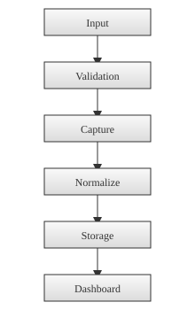
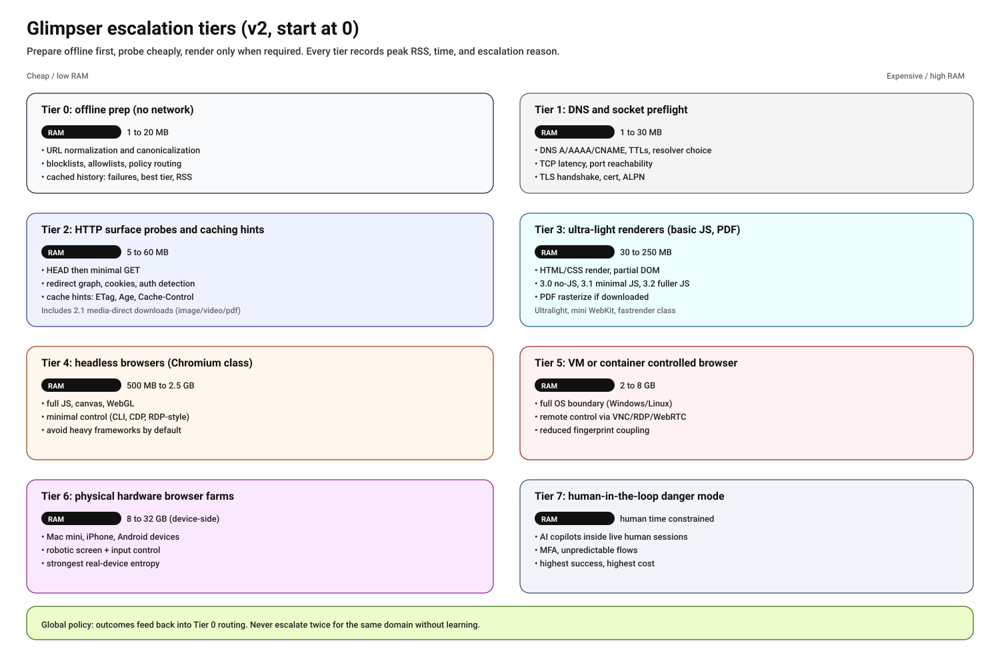

# Capture Process and Flow in Glimpser

This document provides an overview of how the capture process works in the Glimpser project, including the capture flow and the various methods used for different types of content.

## Table of Contents

1. [Overview](#overview)
2. [Main Capture Function](#main-capture-function)
3. [Capture Flow](#capture-flow)
4. [Content-Specific Capture Methods](#content-specific-capture-methods)
5. [Browser-Based Capture](#browser-based-capture)
6. [Post-Processing](#post-processing)
7. [Preflight Tiers](#preflight-tiers)

## Overview

The Glimpser project uses a modular approach to capture content from various sources, including images, PDFs, video streams, and web pages. The capture process is designed to handle different types of content efficiently and provide consistent output.

## Main Capture Function

The main entry point for the capture process is the `capture_or_download` function in `app/utils/screenshots.py`. This function orchestrates the entire capture process by:

1. Parsing the input URL and checking if the host is reachable (for network URLs)
2. Determining the content type
3. Choosing the appropriate capture method based on the content type and other parameters
4. Handling the capture process and any necessary post-processing

## Capture Flow

The general flow of the capture process is as follows:

1. **Input Validation**: Check if the provided name and template are valid.
2. **URL Parsing**: Extract the domain and port from the URL.
3. **Scheme Verification**: Reject URLs that use unsupported schemes (e.g. `file://`) to prevent local file access.
4. **Host Reachability Check**: For network URLs, ensure the target host is reachable.
5. **Output Path Preparation**: Generate a unique output path for the captured content.
6. **Content Type Determination**: Analyze the URL and perform a HEAD request to determine the content type.
7. **Capture Method Selection**: Choose the appropriate capture method based on the content type and other parameters.
8. **Capture Execution**: Execute the selected capture method.
9. **Post-Processing**: Apply any necessary post-processing steps, such as adding timestamps or applying dark mode.
10. **Result Handling**: Return the success status of the capture process.

The waterfall diagram below shows how captured data moves from the initial
source through processing and finally to visualization.

## Preflight Tiers

Glimpser follows a tiered preflight approach to minimize expensive capture
work. Each tier adds more cost and capability, and outcomes should feed back
into earlier tiers so we avoid repeated escalation for sources that are failing.

High-level mapping of tiers to current behavior:

- **Tier 0: Offline prep**: URL normalization, scheme allowlist, cached errors,
  and recent failure backoff before any network calls.
- **Tier 1: DNS/TCP reachability**: Host reachability checks and port
  validation. HTTPS targets perform a lightweight DNS + TLS handshake probe
  (cached) to fail fast on certificate or handshake issues, capturing ALPN
  outcomes when available.
- **Tier 2: HTTP surface probes**: HEAD/GET probes for content type, ETag, and
  cached status codes (including 429 rate limit backoffs). Conditional requests
  use `If-None-Match` / `If-Modified-Since`, and GET probes use byte ranges to
  reduce payload size. Redirect targets and auth-required responses are cached
  so the capture pipeline can avoid expensive retries. Redirect loops are
  detected and temporarily blocked, with redirect chains capped to keep probes
  fast. Cache-Control, Age, and Expires headers are used to tune how long
  content-type results stay valid. Content-Length is tracked and oversized
  payloads can be skipped before download. Alt-Svc headers are cached to
  capture protocol hints (HTTP/2/3). Persistent 401/403/404/410 responses are
  cached so the pipeline can skip repeated attempts, along with the preferred
  auth scheme and realm when advertised. Domain-level cooldowns throttle
  repeated auth/not-found failures across related URLs.
- **Tier 3: Ultra-light renderers**: `wkhtmltoimage` and PhantomJS for simple
  pages where full browser capture is not warranted.
- **Tier 4+: Heavy browser capture**: Selenium/Chromium or danger mode when
  explicitly requested. Danger mode checks the Chrome debug port during
  preflight and backs off if it is unavailable.

Future improvements should keep the tier ordering intact, add new probes ahead
of expensive renders, and use preflight results to avoid retrying high-cost
steps that already failed for a source.

The capture pipeline tracks tier outcomes per domain and temporarily limits
escalation after failures in higher tiers. A successful lower-tier capture
clears the lock so the system can retry heavier approaches only after new
signal.

Within a tier, method-specific exponential backoff is applied to lightweight
and headless renderers plus stream/ytdlp captures after repeated failures. This
avoids retrying expensive tools on the same source every cycle. Stream probes
record codec/fps fingerprints from ffprobe when available, and cached
unsupported codecs are skipped before retrying stream captures.

RTSP sources use a quick OPTIONS preflight to verify the server is responsive.
If a snapshot endpoint is detected for an RTSP host, Glimpser prefers that
lightweight JPEG capture before attempting a full stream decode.

Snapshot discovery includes common vendor endpoints (Hikvision, Axis, generic
CGI, and MJPEG paths) to avoid unnecessary RTSP decoding when a still image is
available.

MJPEG sources perform a short boundary probe before invoking a full decoder to
avoid passing non-multipart content to ffmpeg. Successful browser captures are
remembered per domain to bias future attempts toward the last good renderer.

RTSP streams also issue a lightweight DESCRIBE probe to extract SDP codec hints.
Codec results are cached and used to skip streams that are known to be
unsupported by the capture pipeline.

RTSP preflight now attempts authenticated OPTIONS/DESCRIBE requests when
credentials are present, and caches auth-required outcomes to avoid repeated
handshakes without credentials.

RTSP preflight also tries common substream/profile variants (for example,
channel `101` -> `102` or `subtype=0` -> `subtype=1`) when the primary stream
fails to respond, caching the best-known profile URL for future runs.

RTSP keepalive support is probed with `GET_PARAMETER` once per host and cached
to avoid repeated liveness probes. The stream transport preference (TCP/UDP) is
also cached from successful ffprobe/ffmpeg runs and reused on subsequent
captures, with a fallback to the alternate transport when the preferred one
fails.

Redirect chains are capped and cached to avoid repeated multi-hop retries.
Cookie-wall redirects and content-type mismatches are cached to avoid retrying
image/PDF downloads that return HTML login pages. Preflight latency is tracked
and can suppress heavy browser fallbacks when a host is consistently slow.

Preflight caches for DNS/TLS, redirects, auth hints, and method backoff are
persisted to disk so cold starts do not repeat expensive probes.

Per-domain concurrency is capped during capture so a single host cannot
consume all workers.

## Content-Specific Capture Methods

Glimpser uses different methods to capture various types of content:

1. **Images**: Direct download using the `download_image` function.
2. **PDFs**: Download and convert to image using the `download_pdf` function.
3. **Video Streams**: Capture a frame using `capture_frame_from_stream` or `capture_frame_with_ytdlp` for more complex video sources.
4. **Web Pages**: Use either a lightweight browser capture (`capture_screenshot_and_har_light`) or a full browser capture (`capture_screenshot_and_har`) depending on the complexity of the page and capture requirements.

## Browser-Based Capture

For web pages, Glimpser uses two main approaches:

1. **Lightweight Browser Capture**: Uses `wkhtmltoimage` for simple web pages without complex JavaScript or popup handling requirements. The URL and output path are passed directly to `wkhtmltoimage` without shell quoting.
2. **Full Browser Capture**: Uses Selenium with Chrome/Chromium for more complex web pages, supporting JavaScript execution, popup handling, and custom selectors. These packages are optional and are not required for the default installation.

The choice between these methods depends on factors such as:
- Presence of popups that need to be handled
- Need for JavaScript execution
- Requirement for stealth mode
- When stealth mode is enabled, Glimpser randomizes the window size and builds
  the user agent string from the installed Chrome version to avoid outdated
  fingerprints.
- Presence of dedicated selectors for capturing specific elements

## Post-Processing

After capturing the content, Glimpser applies several post-processing steps:

1. **Background Removal**: Remove unnecessary background from captured images.
   The color along the screenshot edges is sampled and the most common shade is
   treated as the background to crop away.
2. **Dark Mode**: Apply dark mode to the captured image if requested. The image array is copied before modification to avoid "assignment destination is read-only" errors.
3. **Timestamp Addition**: Overlay the capture with the current time in the
   configured timezone. When different from UTC, the UTC time is displayed just
   below the local timestamp. The overlay uses a semi-transparent background and
   stroked fonts to improve readability without obscuring the image. Bounding
   boxes ensure the tint precisely covers the text.
4. **Caption Overlay**: When captions or motion indicators are added, the text

   is wrapped and rendered with the same improved font styling to avoid
   overlapping the content.
5. **Micro Barcode Overlay**: A small 1D barcode containing the camera name is placed in the lower-right corner so screenshots can be tracked within the system.
6. **Image Optimization**: Ensure the captured image is in the correct format and optimized for storage.
7. **PNG Validation**: Verify the temporary screenshot file before renaming it to avoid leaving corrupt images.
8. **Atomic Writes**: Direct downloads first save to a `.tmp` file and move it into place only after validation so live streams never read a partially written PNG.

## Status Code Caching

Glimpser stores the last HTTP status code for each URL in `data/status_cache.json`.
If a previous attempt returned a non‐200 status, further requests are skipped for
one hour. This prevents repeated network calls to unreachable resources.

## Capture Timeout

`CAPTURE_TIMEOUT` controls how long Glimpser waits while grabbing a screenshot or pulling a
frame from a video. If no image is produced before this limit expires, the
capture attempt is aborted and marked as failed. Increase the value if your
streams are slow to respond; lower it to fail fast on unresponsive sources.

## Conclusion

The capture process in Glimpser is designed to be flexible and handle a wide variety of content types and capture scenarios. By using a modular approach and content-specific capture methods, Glimpser can efficiently capture and process content from various sources while maintaining consistency in the output.
