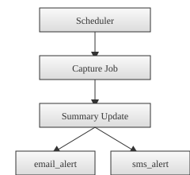

# Capture Summary Sequence

This page explains how a scheduled capture produces a text summary and triggers alerts. The sequence diagram shows the key steps.

## Flow Overview

1. **Scheduler Job** – `schedule_crawlers` sets up periodic capture jobs for each camera template.
2. **Screenshot Capture** – `update_camera` calls `capture_or_download` to grab the latest frame and save it to `data/screenshots/`.
3. **Summary Update** – `update_summary` collects recent captions and requests the language model to generate a summary. The result is stored in the database as a `Summary` record.
4. **Alerts** – When a new summary is saved, `email_alert` and `sms_alert` send notifications with the generated text.
