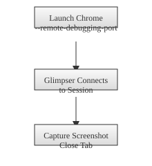

# Danger Mode Setup and Usage

Danger mode allows Glimpser to leverage your existing Chrome session for capturing dynamic sites. When active, Glimpser attaches to a local Chrome instance running with the `--remote-debugging-port=<PORT>` flag where `<PORT>` is the value of the `DANGER_PORT` setting. This is useful for pages that require an authenticated session or user context.

## Enabling Remote Debugging

1. **Launch Chrome with the debugging port open.** The exact command varies by platform:
   - **Linux**: `google-chrome --remote-debugging-port=$DANGER_PORT`
   - **macOS**: `open /Applications/Google\ Chrome.app --args --remote-debugging-port=$DANGER_PORT`
   - **Windows**: modify your Chrome shortcut to append `--remote-debugging-port=%DANGER_PORT%` to the _Target_ field.
2. Leave this Chrome window running. Glimpser will connect to the existing instance when the port is detected.

If Chrome is not started with this flag, Danger mode will be unavailable.

## Shortcut Update Options

After Chrome updates, shortcuts may revert to their original command line. Two approaches can help keep the debug port enabled:

- **Manual update**: Edit the desktop shortcut each time Chrome updates.
- **Helper script**: Run `python scripts/update_chrome_shortcut.py` to rewrite the shortcut with the required flag. This can also be triggered from the _Update Chrome Shortcut_ button on the Settings page or the _Patch Chrome Shortcuts_ button on the Danger page. The page now shows which shortcuts were updated after the patch completes.
- **Dropdown selector**: The Danger page lets you choose a detected shortcut from a dropdown or enter a custom path before patching.
- **Check script**: Run `python scripts/check_danger_mode.py` to print whether the debug port is detected and if your shortcuts still require patching.
- **Default shortcut locations**: `%USERPROFILE%\Desktop`, `%APPDATA%\Microsoft\Windows\Start Menu\Programs`, and `%ProgramData%\Microsoft\Windows\Start Menu\Programs`. On Linux, try `/usr/share/applications/google-chrome.desktop` or `~/.local/share/applications/google-chrome.desktop`. The Settings page lists any writable shortcuts it discovers.

After patching your shortcuts, restart Chrome and open it using the profile you intend to use with Danger mode.

For now, you can store the launch command in a script and double-click it instead of using the original shortcut.

## Using Danger Mode in Glimpser

When Chrome's debug port is open and no user input has been detected for a short period, Glimpser shows an orange indicator in the navigation bar. The icon hides again when Danger mode is unavailable. A `!` appears when ready and an `×` in the tooltip explains why it's disabled.

Captures marked as "Danger" in the template editor will use your running Chrome session. Glimpser opens a new tab, performs the capture, and closes the tab when finished. It skips the operation if you become active while the capture is pending.

The diagram below illustrates the typical flow:

Be cautious with this feature, as it can interact with your browser while you are away. Ensure you trust the pages being captured.

## Enabling or Disabling Danger Mode

Visit `/danger` to toggle the feature on or off. When disabled, captures marked as "Danger" are skipped even if Chrome's debugging port is open.

The **Admin** tab on the Settings page summarizes Danger mode. It shows the detected browser path, indicates if your Chrome shortcuts already include the debugging flag, and reports whether the debugging port is open. Green or red dots highlight the patched and running state.

## Danger Page Overview

The `/danger` page explains what the feature does and when to use it. A short
help section near the top links back to this document. The page notes that
Glimpser attaches to your Chrome session via the debugging port and only
activates when you are idle. Toggling the option now shows a confirmation modal
so the feature is not enabled or disabled accidentally.

Below the description, the page lists any cameras flagged as using Danger mode.
Each item links directly to the camera's template details so you can quickly
review or disable the setting.

## Security Considerations

Enabling the debugging port exposes your active Chrome session to other
programs on the same machine. Keep your system on a trusted network and close
Chrome when you are finished capturing. Avoid running Danger mode if untrusted
software could access `http://localhost:<PORT>` where `<PORT>` matches
`DANGER_PORT`.

## Connection Troubleshooting

If Glimpser does not detect your Chrome instance:

1. Visit `http://localhost:$DANGER_PORT` in a browser. A JSON page should appear if the
   port is open.
2. Confirm Chrome was started with the flag and that no firewall is blocking the
   connection.
3. Try restarting Glimpser after verifying the port is reachable.

## Customizing the Debugging Port

If the default port is already in use, launch Chrome with a different value such
as `--remote-debugging-port=9333`. Set `DANGER_PORT` to the same number so
Glimpser knows where to connect.

## Temporary Enablement

For extra safety, consider enabling Danger mode only for a single capture or a
short time. After running a job, disable the feature on `/danger` so Chrome's
debug port is not left open longer than needed.

## Example Walkthrough

1. Start Chrome with the remote debugging flag and sign in to the site you want
   to capture.
2. Open `/danger` in Glimpser and enable the mode.
3. Trigger a capture for a camera that requires Danger mode.
4. Once it finishes, disable Danger mode again.
