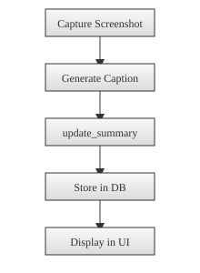

# LLM Summarization Flow

Glimpser turns captured screenshots into short textual summaries so you can grasp current system status at a glance.

## Screenshot Capture
When a template runs, `capture_or_download` in `app/utils/screenshots.py` saves an image and updates `last_screenshot_time` in the database.

## Caption Generation
`caption_image` from `app/utils/image_processing.py` sends the screenshot to the language model. The result becomes `last_caption` for that template.

## `update_summary`
The scheduled function `update_summary` in `app/utils/scheduling.py` collects recent captions and calls the language model using the prompt defined by `LLM_SUMMARY_PROMPT`. The response is stored in the `Summary` table with a timestamp.

## Database and UI
Summaries are retrieved through `get_last_summary_time()` and displayed on the Captions page. The latest entry also appears on the home screen.

