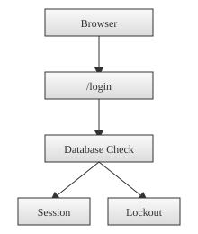

# Login Flow

The `/login` route handles both GET and POST requests. When a user submits credentials the server first checks the `login_attempts` table to see if the client's IP address is temporarily locked out. Failed attempts trigger short rate limits after every second failure and a 24‑hour lockout after five failures.

If the request proceeds, the username and password are validated against the `User` table. On success the session stores `user_id`, an expiry timestamp and the optional `remember` flag. The lifetime defaults to `SESSION_TIMEOUT_MINUTES` and extends to `AUTO_LOGIN_DAYS` when "Remember me" is checked. The lockout counter resets after a successful login.

Invalid credentials increment the attempt count and may eventually lock out the IP. The server returns the login page with an error message or status `429` when locked out.

When a user logs in with a temporary password (for example after a recovery reset), the session is marked to require a password change. The user is redirected to the reset form and all other routes return a reset-required response until a new password is saved. The event is recorded in logs and the most recent reset timestamps are stored in settings for later review.

