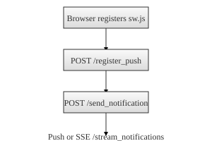

# Notifications Flow

Glimpser uses a Service Worker to deliver push notifications when possible. When users first open the site the browser registers `sw.js`. The script subscribes to push messages and sends the resulting subscription object to `/register_push`.

Later any component can queue a message by POSTing to `/send_notification` with `title` and `body` fields. The server delivers the notification to all stored subscriptions.

Browsers that do not support push still poll `/stream_notifications` with Server‑Sent Events (SSE). The main interface opens an `EventSource` that displays incoming notifications using the Notification API.

