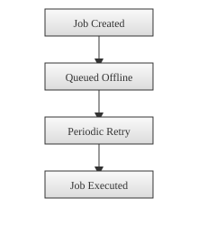

# Offline Job Flow

When Glimpser cannot reach external services, some scheduled tasks are deferred instead of failing. Each skipped job is stored in the `offline_jobs` table with the function name, arguments, timeout and a timestamp.

A background scheduler calls `process_offline_jobs` every 30 seconds. If connectivity has been restored, each stored job is imported and executed with `run_with_timeout`. Successful runs remove the entry from the table so it will not be retried again. Failures leave the job in the queue for the next attempt.

The diagram below summarizes this process:

