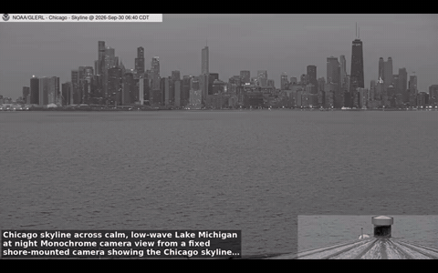
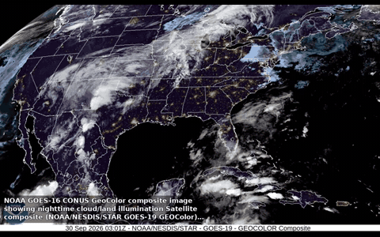

# Weather and sky timelapses

Glimpser turns timestamped images into visual histories. These examples use
images already collected by Glimpser from NOAA's public sources, showing a
local lakefront view alongside the wider weather picture.

## Chicago skyline from Lake Michigan

[Watch or download the MP4](assets/showcase/chicago-lake-sky.mp4).

The Harrison-Dever Crib camera looks toward Chicago from approximately
2.75 miles offshore. This sequence shows changing light and visibility on
September 30, 2026. Source imagery: **NOAA Great Lakes Environmental Research
Laboratory**. [Camera and weather observations](https://www.glerl.noaa.gov/metdata/chi/).

## Clouds across the continental United States

[Watch or download the MP4](assets/showcase/continental-clouds.mp4).

GOES-East GeoColor imagery provides context for the local camera observations.
This sequence covers captures from September 30 into October 1, 2026.
Source imagery: **NOAA / NESDIS Center for Satellite Applications and Research**.
[GOES imagery viewer](https://www.star.nesdis.noaa.gov/GOES/).

## What these examples represent

These are independently assembled Glimpser demonstrations, not official NOAA
products or calibrated scientific measurements. MP4s play archived captures at
five frames per second; GIFs are smaller three-frame-per-second previews.
Capture intervals vary, and repeated source observations can occur. Playback
speed should not be interpreted as a constant real-world time scale.

The original source labels and Glimpser's existing automated captions remain
visible. Captions are unverified: the satellite feed's legacy GOES16 identifier
and some captions say GOES-16, while the current source imagery is **GOES-19**.
Use the source's embedded observation timestamp rather than a capture timestamp
when determining when an observation was made. No synthetic or interpolated
visual frames were added.

[Frame provenance](assets/showcase/manifest.json) records capture filenames and
SHA-256 hashes. Filenames retain the archive's timestamp convention; they do not
establish source observation time.

## Contribute a weather-facing view

We are seeking permission to use local sky and horizon views for an independent
computer science project exploring cloud cover, visibility, and changes over
time. Occasional still images, a fixed sky-facing crop, or a delayed feed can
work. Collection frequency, retention, attribution, access, and any publication
permission would be agreed with the operator before adding a participating feed.

Contact **kristopher@acm.org** or visit the
[Glimpser project](https://github.com/KristopherKubicki/glimpser).

Source imagery is credited to its providers and is not claimed under Glimpser's
software license. See [NOAA GLERL's reuse notice](https://www.glerl.noaa.gov/home/notice.html)
and [NOAA STAR's use and credit guidance](https://star.nesdis.noaa.gov/star/productdisclaimer.php).
The examples do not imply provider endorsement or affiliation.
